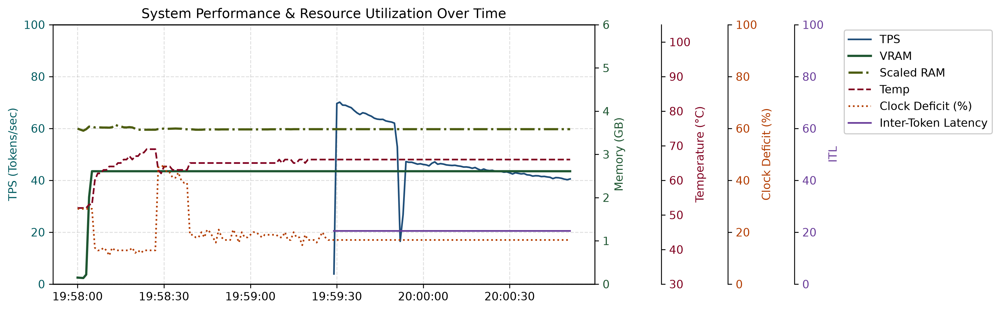

# Empirical Benchmarking of Local LLM Inference Under Thermal Constraints (Using Cooling Pads)

This repository evaluates local Large Language Model (LLM) inference performance under strict hardware constraints, mapping the relationship between software configurations and real-time hardware telemetry. The framework systematically benchmarks how variables like context window depth, and quantization matrix bit-widths affect Tokens Per Second (TPS), Time to First Token (TTFT), and VRAM allocation.

Beyond standard software profiling, this suite features a controlled silicon thermal study. By benchmarking identical model configurations across standardized starting temperatures ($<50^\circ\text{C}$, $60^\circ\text{C}$, $70^\circ\text{C}$, and $80^\circ\text{C}$), the project empirically demonstrates the physical limits of edge hardware—proving that degrades generation throughput by nearly 10% compared to a stabilized cold baseline. Performance ceiling is constrained by RTX 3050-class laptop 6 GB GPU VRAM.


## ⚙️ What it tests

The system runs structured experiments across a multi-dimensional parameter grid:

Model: Qwen2.5-VL-3B

Context Sizes: ctx_sizes = [65536, 32768, 16384, 8192, 4096]

Model Quantization Formats: [F16, Q8_0, Q4_K_M]

GPU Layer Offloading Levels: [-1] -> 100% GPU Only

All combinations are repeated twice at different Silicon Temp Start = [50C, 60C, 70C, 80C]

So for 50C Temp, there are 15 such combinations = Total 60 experiments.

While evaluating each configuration using a standardized prompt set, the framework systematically varies the baseline silicon starting temperature. During execution, an asynchronous telemetry thread captures instantaneous Tokens Per Second (TPS) alongside real-time core temperatures, mapping exactly how dynamic thermal loading impacts active generation throughput.


## 📊 Metrics collected

For each run, the following are recorded:

Instantaneous Tokens per second (TPS)
Time to first token (TTFT)
Inter-token latency (ITL)
GPU temperature
VRAM usage
RAM Usage
Estimated throttling behavior


### 📋 Full Telemetry Data

<details>
<summary><b>Click to expand full telemetry logs table</b></summary>

| Timestamp | PState | VRAM (GB) | GPU Util (%) | CPU Load (%) | RAM Used (GB) | RAM Util (%) | GPU Mem Util (%) | Power (W) | Temp (°C) | Clock (MHz) | Clock Deficit |
| :--- | :---: | :---: | :---: | :---: | :---: | :---: | :---: | :---: | :---: | :---: | :---: |
| 21-06-2026 10:46:36 | P0 | 0.14 | 0 | 0.0 | 15.16 | 63.9 | 0 | 8.9 | 41 | 1492 | 29 |
| 21-06-2026 10:46:37 | P0 | 0.14 | 0 | 10.2 | 14.97 | 63.1 | 0 | 5.5 | 40 | 1492 | 29 |
| 21-06-2026 10:46:38 | P0 | 0.20 | 0 | 16.3 | 15.08 | 63.6 | 0 | 8.7 | 42 | 1492 | 29 |
| 21-06-2026 10:46:40 | P0 | 5.27 | 9 | 36.2 | 15.37 | 64.8 | 1 | 11.4 | 42 | 1845 | 12 |
| 21-06-2026 10:46:41 | P0 | 5.92 | 59 | 34.4 | 16.29 | 68.7 | 18 | 15.4 | 43 | 1965 | 6 |
| 21-06-2026 10:46:42 | P0 | 5.92 | 26 | 21.6 | 16.27 | 68.6 | 1 | 31.3 | 46 | 1965 | 6 |
| 21-06-2026 10:46:43 | P0 | 5.92 | 100 | 15.1 | 16.27 | 68.6 | 6 | 30.7 | 47 | 1957 | 7 |
| 21-06-2026 10:46:44 | P0 | 5.93 | 97 | 6.9 | 16.27 | 68.6 | 100 | 43.1 | 51 | 1957 | 7 |
| 21-06-2026 10:46:45 | P0 | 5.93 | 97 | 6.9 | 16.27 | 68.6 | 100 | 68.6 | 52 | 1972 | 6 |
| 21-06-2026 10:46:46 | P0 | 5.93 | 97 | 7.2 | 16.27 | 68.6 | 100 | 68.7 | 53 | 1972 | 6 |
| 21-06-2026 10:46:47 | P0 | 5.93 | 96 | 7.6 | 16.27 | 68.6 | 99 | 68.5 | 54 | 1972 | 6 |
| 21-06-2026 10:46:48 | P0 | 5.93 | 96 | 7.1 | 16.27 | 68.6 | 97 | 68.2 | 54 | 1972 | 6 |
| 21-06-2026 10:46:49 | P0 | 5.93 | 96 | 8.0 | 16.27 | 68.6 | 96 | 67.6 | 55 | 1972 | 6 |
| 21-06-2026 10:46:50 | P0 | 5.93 | 96 | 9.3 | 16.28 | 68.6 | 97 | 67.8 | 55 | 1972 | 6 |
| 21-06-2026 10:46:51 | P0 | 5.93 | 96 | 6.7 | 16.27 | 68.6 | 96 | 67.7 | 55 | 1972 | 6 |
| 21-06-2026 10:46:52 | P0 | 5.93 | 95 | 6.8 | 16.27 | 68.6 | 97 | 67.7 | 56 | 1972 | 6 |
| 21-06-2026 10:46:53 | P0 | 5.93 | 96 | 6.8 | 16.27 | 68.6 | 96 | 67.5 | 56 | 1972 | 6 |
| 21-06-2026 10:46:54 | P0 | 5.93 | 95 | 7.9 | 16.27 | 68.6 | 97 | 67.7 | 57 | 1965 | 6 |
| 21-06-2026 10:46:55 | P0 | 5.93 | 95 | 9.1 | 16.29 | 68.7 | 96 | 67.0 | 57 | 1965 | 6 |
| 21-06-2026 10:46:56 | P0 | 5.93 | 95 | 7.3 | 16.28 | 68.6 | 94 | 67.0 | 57 | 1965 | 6 |
| 21-06-2026 10:46:57 | P0 | 5.93 | 94 | 9.3 | 16.28 | 68.6 | 92 | 66.9 | 58 | 1965 | 6 |
| 21-06-2026 10:46:58 | P0 | 5.93 | 95 | 7.3 | 16.28 | 68.6 | 96 | 66.9 | 58 | 1965 | 6 |
| 21-06-2026 10:46:59 | P0 | 5.93 | 95 | 6.7 | 16.28 | 68.6 | 93 | 67.0 | 58 | 1965 | 6 |
| 21-06-2026 10:47:00 | P0 | 5.93 | 96 | 7.0 | 16.28 | 68.6 | 95 | 66.9 | 59 | 1965 | 6 |
| 21-06-2026 10:47:01 | P0 | 5.93 | 94 | 6.5 | 16.27 | 68.6 | 92 | 66.8 | 59 | 1965 | 6 |
| 21-06-2026 10:47:02 | P0 | 5.93 | 95 | 7.2 | 16.28 | 68.6 | 91 | 66.0 | 59 | 1965 | 6 |
| 21-06-2026 10:47:03 | P0 | 5.93 | 94 | 8.6 | 16.27 | 68.6 | 93 | 66.1 | 59 | 1965 | 6 |
| 21-06-2026 10:47:04 | P0 | 5.93 | 94 | 9.7 | 16.27 | 68.6 | 90 | 66.2 | 60 | 1965 | 6 |
| 21-06-2026 10:47:05 | P0 | 5.93 | 95 | 7.1 | 16.27 | 68.6 | 93 | 66.4 | 60 | 1965 | 6 |
| 21-06-2026 10:47:06 | P0 | 5.93 | 93 | 7.2 | 16.26 | 68.6 | 91 | 66.5 | 60 | 1965 | 6 |
| 21-06-2026 10:47:07 | P0 | 5.93 | 94 | 6.7 | 16.26 | 68.6 | 92 | 66.1 | 60 | 1965 | 6 |
| 21-06-2026 10:47:08 | P0 | 5.93 | 94 | 9.9 | 16.27 | 68.6 | 91 | 65.9 | 61 | 1965 | 6 |
| 21-06-2026 10:47:09 | P0 | 5.93 | 91 | 9.4 | 16.27 | 68.6 | 89 | 65.1 | 61 | 1965 | 6 |
| 21-06-2026 10:47:10 | P0 | 5.93 | 93 | 16.9 | 16.27 | 68.6 | 88 | 65.1 | 61 | 1965 | 6 |
| 21-06-2026 10:47:11 | P0 | 5.93 | 92 | 11.4 | 16.26 | 68.6 | 89 | 65.3 | 61 | 1950 | 7 |
| 21-06-2026 10:47:12 | P0 | 5.93 | 94 | 10.0 | 16.27 | 68.6 | 92 | 65.1 | 62 | 1950 | 7 |
| 21-06-2026 10:47:13 | P0 | 5.93 | 93 | 19.9 | 16.27 | 68.6 | 87 | 65.1 | 62 | 1950 | 7 |
| 21-06-2026 10:47:14 | P0 | 5.93 | 90 | 8.6 | 16.27 | 68.6 | 85 | 65.0 | 62 | 1950 | 7 |
| 21-06-2026 10:47:15 | P0 | 5.93 | 92 | 9.2 | 16.25 | 68.5 | 89 | 65.1 | 62 | 1950 | 7 |
| 21-06-2026 10:47:16 | P0 | 5.93 | 91 | 7.7 | 16.25 | 68.5 | 84 | 64.7 | 62 | 1950 | 7 |
| 21-06-2026 10:47:17 | P0 | 5.93 | 93 | 7.4 | 16.24 | 68.5 | 89 | 64.4 | 62 | 1950 | 7 |
| 21-06-2026 10:47:18 | P0 | 5.93 | 93 | 8.0 | 16.24 | 68.5 | 86 | 64.5 | 63 | 1950 | 7 |
| 21-06-2026 10:47:19 | P0 | 5.93 | 91 | 8.1 | 16.24 | 68.5 | 86 | 64.5 | 63 | 1950 | 7 |
| 21-06-2026 10:47:20 | P0 | 5.93 | 93 | 6.0 | 16.24 | 68.5 | 88 | 64.6 | 63 | 1950 | 7 |
| 21-06-2026 10:47:21 | P0 | 5.93 | 91 | 9.7 | 16.24 | 68.5 | 83 | 64.7 | 63 | 1950 | 7 |
| 21-06-2026 10:47:22 | P0 | 5.93 | 90 | 10.3 | 16.24 | 68.5 | 86 | 64.3 | 63 | 1950 | 7 |
| 21-06-2026 10:47:23 | P0 | 5.93 | 88 | 9.3 | 16.24 | 68.5 | 80 | 64.1 | 64 | 1950 | 7 |
| 21-06-2026 10:47:24 | P0 | 5.93 | 92 | 8.2 | 16.25 | 68.5 | 85 | 63.8 | 64 | 1950 | 7 |
| 21-06-2026 10:47:25 | P0 | 5.93 | 90 | 12.5 | 16.24 | 68.5 | 83 | 63.7 | 64 | 1950 | 7 |
| 21-06-2026 10:47:26 | P0 | 5.93 | 92 | 7.8 | 16.24 | 68.5 | 86 | 63.9 | 64 | 1950 | 7 |
| 21-06-2026 10:47:27 | P0 | 5.93 | 91 | 7.6 | 16.24 | 68.5 | 82 | 63.6 | 64 | 1950 | 7 |
| 21-06-2026 10:47:28 | P0 | 5.93 | 90 | 10.0 | 16.24 | 68.5 | 81 | 63.8 | 64 | 1950 | 7 |
| 21-06-2026 10:47:29 | P0 | 5.93 | 90 | 7.5 | 16.24 | 68.5 | 84 | 63.7 | 65 | 1950 | 7 |
| 21-06-2026 10:47:30 | P0 | 5.93 | 92 | 8.4 | 16.24 | 68.5 | 87 | 63.6 | 65 | 1950 | 7 |
| 21-06-2026 10:47:31 | P0 | 5.93 | 92 | 9.7 | 16.24 | 68.5 | 85 | 63.3 | 65 | 1950 | 7 |
| 21-06-2026 10:47:32 | P0 | 5.93 | 87 | 7.2 | 16.24 | 68.5 | 80 | 63.0 | 65 | 1950 | 7 |
| 21-06-2026 10:47:33 | P0 | 5.93 | 92 | 7.0 | 16.24 | 68.5 | 82 | 63.2 | 65 | 1950 | 7 |
| 21-06-2026 10:47:34 | P0 | 5.93 | 92 | 7.5 | 16.24 | 68.5 | 85 | 63.2 | 65 | 1950 | 7 |
| 21-06-2026 10:47:35 | P0 | 5.93 | 91 | 7.0 | 16.24 | 68.5 | 81 | 63.2 | 65 | 1950 | 7 |
| 21-06-2026 10:47:36 | P0 | 5.93 | 91 | 7.0 | 16.24 | 68.5 | 84 | 63.1 | 65 | 1950 | 7 |
| 21-06-2026 10:47:37 | P0 | 5.93 | 91 | 7.0 | 16.24 | 68.5 | 81 | 62.9 | 66 | 1950 | 7 |
| 21-06-2026 10:47:38 | P0 | 5.93 | 91 | 8.1 | 16.24 | 68.5 | 84 | 62.9 | 66 | 1950 | 7 |
| 21-06-2026 10:47:39 | P0 | 5.93 | 90 | 12.5 | 16.25 | 68.5 | 82 | 62.4 | 66 | 1950 | 7 |
| 21-06-2026 10:47:40 | P0 | 5.93 | 88 | 15.0 | 16.25 | 68.5 | 79 | 62.5 | 66 | 1950 | 7 |
| 21-06-2026 10:47:41 | P0 | 5.93 | 90 | 12.1 | 16.24 | 68.5 | 79 | 62.5 | 66 | 1950 | 7 |
| 21-06-2026 10:47:42 | P0 | 5.93 | 90 | 9.2 | 16.24 | 68.5 | 80 | 62.4 | 66 | 1950 | 7 |
| 21-06-2026 10:47:43 | P0 | 5.93 | 89 | 9.3 | 16.24 | 68.5 | 79 | 62.5 | 66 | 1942 | 8 |
| 21-06-2026 10:47:44 | P0 | 5.93 | 87 | 8.0 | 16.24 | 68.5 | 79 | 62.4 | 66 | 1942 | 8 |
| 21-06-2026 10:47:45 | P0 | 5.93 | 90 | 8.5 | 16.24 | 68.5 | 78 | 62.6 | 67 | 1942 | 8 |
| 21-06-2026 10:47:46 | P0 | 5.93 | 90 | 7.9 | 16.24 | 68.5 | 82 | 62.6 | 67 | 1942 | 8 |
| 21-06-2026 10:47:47 | P0 | 5.93 | 90 | 5.9 | 16.24 | 68.5 | 78 | 61.9 | 67 | 1942 | 8 |
| 21-06-2026 10:47:48 | P0 | 5.93 | 90 | 6.6 | 16.24 | 68.5 | 79 | 62.3 | 67 | 1942 | 8 |
| 21-06-2026 10:47:49 | P0 | 5.93 | 87 | 7.7 | 16.24 | 68.5 | 76 | 62.2 | 66 | 1942 | 8 |
| 21-06-2026 10:47:50 | P0 | 5.93 | 90 | 8.3 | 16.24 | 68.5 | 80 | 62.2 | 67 | 1942 | 8 |
| 21-06-2026 10:47:51 | P0 | 5.93 | 90 | 7.3 | 16.24 | 68.5 | 80 | 61.9 | 67 | 1942 | 8 |
| 21-06-2026 10:47:52 | P0 | 5.93 | 89 | 7.7 | 16.24 | 68.5 | 80 | 61.8 | 67 | 1942 | 8 |
| 21-06-2026 10:47:53 | P0 | 5.93 | 89 | 7.5 | 16.24 | 68.5 | 80 | 61.9 | 67 | 1942 | 8 |
| 21-06-2026 10:47:54 | P0 | 5.93 | 89 | 10.4 | 16.25 | 68.5 | 79 | 61.8 | 67 | 1942 | 8 |
| 21-06-2026 10:47:55 | P0 | 5.93 | 90 | 6.6 | 16.24 | 68.5 | 77 | 61.1 | 67 | 1942 | 8 |
| 21-06-2026 10:47:56 | P0 | 5.93 | 89 | 7.9 | 16.23 | 68.4 | 77 | 61.2 | 67 | 1942 | 8 |
| 21-06-2026 10:47:57 | P0 | 5.93 | 88 | 7.7 | 16.23 | 68.4 | 77 | 61.2 | 67 | 1942 | 8 |
| 21-06-2026 10:47:58 | P0 | 5.93 | 88 | 6.7 | 16.23 | 68.4 | 77 | 60.9 | 67 | 1942 | 8 |
| 21-06-2026 10:47:59 | P0 | 5.93 | 89 | 10.6 | 16.23 | 68.4 | 77 | 61.0 | 67 | 1942 | 8 |
| 21-06-2026 10:48:00 | P0 | 5.93 | 88 | 7.8 | 16.23 | 68.4 | 77 | 61.0 | 67 | 1942 | 8 |
| 21-06-2026 10:48:01 | P0 | 5.93 | 88 | 8.0 | 16.23 | 68.4 | 76 | 61.0 | 67 | 1942 | 8 |
| 21-06-2026 10:48:02 | P0 | 5.93 | 88 | 7.4 | 16.23 | 68.4 | 76 | 61.0 | 67 | 1942 | 8 |
| 21-06-2026 10:48:03 | P0 | 5.93 | 89 | 7.6 | 16.24 | 68.5 | 76 | 60.7 | 67 | 1942 | 8 |
| 21-06-2026 10:48:04 | P0 | 5.93 | 88 | 10.0 | 16.24 | 68.5 | 74 | 60.2 | 67 | 1942 | 8 |
| 21-06-2026 10:48:05 | P0 | 5.93 | 88 | 7.0 | 16.23 | 68.4 | 76 | 60.5 | 67 | 1942 | 8 |
| 21-06-2026 10:48:06 | P0 | 5.93 | 88 | 7.3 | 16.23 | 68.4 | 74 | 60.0 | 67 | 1942 | 8 |
| 21-06-2026 10:48:07 | P0 | 5.93 | 86 | 12.4 | 16.23 | 68.5 | 75 | 60.0 | 67 | 1942 | 8 |
| 21-06-2026 10:48:09 | P0 | 5.93 | 89 | 13.8 | 16.23 | 68.4 | 75 | 60.1 | 67 | 1942 | 8 |
| 21-06-2026 10:48:10 | P0 | 5.93 | 87 | 8.7 | 16.23 | 68.4 | 74 | 60.0 | 67 | 1942 | 8 |
| 21-06-2026 10:48:11 | P0 | 5.93 | 88 | 12.7 | 16.23 | 68.4 | 76 | 59.8 | 67 | 1942 | 8 |
| 21-06-2026 10:48:12 | P0 | 5.93 | 87 | 15.1 | 16.23 | 68.5 | 74 | 60.1 | 67 | 1942 | 8 |
| 21-06-2026 10:48:13 | P0 | 5.93 | 90 | 7.6 | 16.23 | 68.4 | 75 | 59.6 | 67 | 1942 | 8 |
| 21-06-2026 10:48:14 | P0 | 5.93 | 87 | 7.3 | 16.23 | 68.4 | 74 | 59.7 | 67 | 1942 | 8 |
| 21-06-2026 10:48:15 | P0 | 5.93 | 88 | 7.1 | 16.23 | 68.4 | 74 | 59.6 | 67 | 1942 | 8 |
| 21-06-2026 10:48:16 | P0 | 5.93 | 87 | 9.2 | 16.23 | 68.4 | 75 | 59.5 | 67 | 1942 | 8 |
| 21-06-2026 10:48:17 | P0 | 5.93 | 87 | 8.1 | 16.23 | 68.4 | 72 | 59.4 | 67 | 1942 | 8 |
| 21-06-2026 10:48:18 | P0 | 5.93 | 87 | 8.8 | 16.23 | 68.4 | 73 | 59.4 | 67 | 1942 | 8 |
| 21-06-2026 10:48:19 | P0 | 5.93 | 90 | 11.0 | 16.23 | 68.5 | 75 | 59.5 | 67 | 1942 | 8 |
| 21-06-2026 10:48:20 | P0 | 5.93 | 86 | 11.8 | 16.23 | 68.5 | 73 | 59.2 | 67 | 1942 | 8 |
| 21-06-2026 10:48:21 | P0 | 5.93 | 87 | 6.6 | 16.23 | 68.4 | 71 | 59.2 | 67 | 1942 | 8 |
| 21-06-2026 10:48:22 | P0 | 5.93 | 86 | 8.1 | 16.23 | 68.4 | 72 | 59.4 | 67 | 1942 | 8 |
| 21-06-2026 10:48:23 | P0 | 5.93 | 87 | 7.6 | 16.23 | 68.4 | 73 | 59.1 | 67 | 1942 | 8 |
| 21-06-2026 10:48:24 | P0 | 5.93 | 86 | 6.4 | 16.23 | 68.4 | 70 | 59.1 | 67 | 1942 | 8 |
| 21-06-2026 10:48:25 | P0 | 5.93 | 86 | 11.8 | 16.24 | 68.5 | 70 | 58.9 | 67 | 1942 | 8 |
| 21-06-2026 10:48:26 | P0 | 5.93 | 85 | 20.1 | 16.27 | 68.6 | 72 | 58.7 | 67 | 1942 | 8 |
| 21-06-2026 10:48:27 | P0 | 5.93 | 85 | 11.5 | 16.26 | 68.5 | 74 | 58.6 | 67 | 1942 | 8 |
| 21-06-2026 10:48:28 | P0 | 5.93 | 86 | 7.9 | 16.25 | 68.5 | 74 | 58.8 | 67 | 1942 | 8 |
| 21-06-2026 10:48:29 | P0 | 5.93 | 88 | 16.6 | 16.30 | 68.7 | 74 | 58.8 | 67 | 1942 | 8 |
| 21-06-2026 10:48:30 | P0 | 5.93 | 86 | 18.4 | 16.31 | 68.8 | 72 | 58.6 | 68 | 1942 | 8 |
| 21-06-2026 10:48:31 | P0 | 5.93 | 84 | 17.8 | 16.32 | 68.8 | 67 | 58.0 | 68 | 1942 | 8 |
| 21-06-2026 10:48:32 | P0 | 5.93 | 87 | 20.1 | 16.35 | 68.9 | 73 | 58.1 | 67 | 1942 | 8 |
| 21-06-2026 10:48:33 | P0 | 5.93 | 84 | 19.0 | 16.36 | 69.0 | 66 | 57.9 | 68 | 1942 | 8 |
| 21-06-2026 10:48:34 | P0 | 5.93 | 87 | 16.1 | 16.35 | 69.0 | 73 | 58.2 | 68 | 1942 | 8 |
| 21-06-2026 10:48:35 | P0 | 5.93 | 84 | 16.4 | 16.36 | 69.0 | 66 | 58.1 | 68 | 1942 | 8 |
| 21-06-2026 10:48:36 | P0 | 5.93 | 88 | 15.5 | 16.36 | 69.0 | 73 | 58.2 | 68 | 1942 | 8 |
| 21-06-2026 10:48:37 | P0 | 5.93 | 84 | 17.3 | 16.36 | 69.0 | 67 | 57.9 | 68 | 1942 | 8 |
| 21-06-2026 10:48:38 | P0 | 5.93 | 84 | 16.7 | 16.36 | 69.0 | 74 | 58.2 | 68 | 1942 | 8 |
| 21-06-2026 10:48:39 | P0 | 5.93 | 87 | 16.5 | 16.37 | 69.0 | 69 | 58.1 | 68 | 1942 | 8 |
| 21-06-2026 10:48:40 | P0 | 5.93 | 89 | 33.4 | 16.44 | 69.3 | 70 | 57.6 | 68 | 1942 | 8 |
| 21-06-2026 10:48:41 | P0 | 5.93 | 89 | 30.7 | 16.42 | 69.2 | 73 | 60.9 | 68 | 1942 | 8 |
| 21-06-2026 10:48:42 | P0 | 5.93 | 83 | 33.9 | 16.41 | 69.2 | 72 | 57.6 | 68 | 1942 | 8 |
| 21-06-2026 10:48:43 | P0 | 5.93 | 84 | 17.7 | 16.41 | 69.2 | 65 | 57.4 | 68 | 1942 | 8 |
| 21-06-2026 10:48:44 | P0 | 5.93 | 84 | 9.6 | 16.43 | 69.3 | 64 | 57.4 | 68 | 1942 | 8 |
| 21-06-2026 10:48:45 | P0 | 5.93 | 89 | 10.1 | 16.47 | 69.5 | 71 | 57.6 | 68 | 1942 | 8 |
| 21-06-2026 10:48:46 | P0 | 5.93 | 88 | 12.4 | 16.51 | 69.6 | 70 | 57.8 | 69 | 1942 | 8 |
| 21-06-2026 10:48:47 | P0 | 5.93 | 83 | 13.3 | 16.55 | 69.8 | 71 | 57.7 | 68 | 1942 | 8 |
| 21-06-2026 10:48:48 | P0 | 5.93 | 83 | 12.7 | 16.56 | 69.8 | 68 | 57.4 | 68 | 1942 | 8 |
| 21-06-2026 10:48:49 | P0 | 5.93 | 89 | 25.5 | 16.62 | 70.1 | 68 | 57.2 | 69 | 1942 | 8 |
| 21-06-2026 10:48:50 | P0 | 5.93 | 83 | 19.2 | 16.62 | 70.1 | 62 | 56.4 | 69 | 1942 | 8 |
| 21-06-2026 10:48:51 | P0 | 5.93 | 83 | 13.9 | 16.62 | 70.1 | 69 | 56.9 | 69 | 1942 | 8 |

> **Note:** All rows map back to `RUN_ID: a9506584-709b-47ac-974f-1f84949567c7`


| Second | Runtime Engine | Backend | Framework | KV Cache | Context ($n\_ctx$) | Model | GPU Layers | F16 KV | TTFT (s) | Avg TPS | ITL (ms) | P:O Ratio | Latency (s) | Instant TPS |
| :---: | :--- | :--- | :--- | :---: | :---: | :--- | :---: | :---: | :---: | :---: | :---: | :---: | :---: | :---: |
| 1 | llama-cpp-python | CUDA 13.3 | GGUF | bf16 | 98304 | Qwen2.5-VL-3B-Q8 | -1 | TRUE | 2.89 | 31.77 | 32.1 | 0.21 | 131.47 | 41.47 |
| 2 | llama-cpp-python | CUDA 13.3 | GGUF | bf16 | 98304 | Qwen2.5-VL-3B-Q8 | -1 | TRUE | 2.89 | 31.77 | 32.1 | 0.21 | 131.47 | 40.22 |
| 3 | llama-cpp-python | CUDA 13.3 | GGUF | bf16 | 98304 | Qwen2.5-VL-3B-Q8 | -1 | TRUE | 2.89 | 31.77 | 32.1 | 0.21 | 131.47 | 40.09 |
| 4 | llama-cpp-python | CUDA 13.3 | GGUF | bf16 | 98304 | Qwen2.5-VL-3B-Q8 | -1 | TRUE | 2.89 | 31.77 | 32.1 | 0.21 | 131.47 | 39.81 |
| 5 | llama-cpp-python | CUDA 13.3 | GGUF | bf16 | 98304 | Qwen2.5-VL-3B-Q8 | -1 | TRUE | 2.89 | 31.77 | 32.1 | 0.21 | 131.47 | 38.59 |
| 6 | llama-cpp-python | CUDA 13.3 | GGUF | bf16 | 98304 | Qwen2.5-VL-3B-Q8 | -1 | TRUE | 2.89 | 31.77 | 32.1 | 0.21 | 131.47 | 38.69 |
| 7 | llama-cpp-python | CUDA 13.3 | GGUF | bf16 | 98304 | Qwen2.5-VL-3B-Q8 | -1 | TRUE | 2.89 | 31.77 | 32.1 | 0.21 | 131.47 | 38.87 |
| 8 | llama-cpp-python | CUDA 13.3 | GGUF | bf16 | 98304 | Qwen2.5-VL-3B-Q8 | -1 | TRUE | 2.89 | 31.77 | 32.1 | 0.21 | 131.47 | 38.72 |
| 9 | llama-cpp-python | CUDA 13.3 | GGUF | bf16 | 98304 | Qwen2.5-VL-3B-Q8 | -1 | TRUE | 2.89 | 31.77 | 32.1 | 0.21 | 131.47 | 38.41 |
| 10 | llama-cpp-python | CUDA 13.3 | GGUF | bf16 | 98304 | Qwen2.5-VL-3B-Q8 | -1 | TRUE | 2.89 | 31.77 | 32.1 | 0.21 | 131.47 | 38.61 |
| 11 | llama-cpp-python | CUDA 13.3 | GGUF | bf16 | 98304 | Qwen2.5-VL-3B-Q8 | -1 | TRUE | 2.89 | 31.77 | 32.1 | 0.21 | 131.47 | 37.95 |
| 12 | llama-cpp-python | CUDA 13.3 | GGUF | bf16 | 98304 | Qwen2.5-VL-3B-Q8 | -1 | TRUE | 2.89 | 31.77 | 32.1 | 0.21 | 131.47 | 37.75 |
| 13 | llama-cpp-python | CUDA 13.3 | GGUF | bf16 | 98304 | Qwen2.5-VL-3B-Q8 | -1 | TRUE | 2.89 | 31.77 | 32.1 | 0.21 | 131.47 | 37.69 |
| 14 | llama-cpp-python | CUDA 13.3 | GGUF | bf16 | 98304 | Qwen2.5-VL-3B-Q8 | -1 | TRUE | 2.89 | 31.77 | 32.1 | 0.21 | 131.47 | 37.49 |
| 15 | llama-cpp-python | CUDA 13.3 | GGUF | bf16 | 98304 | Qwen2.5-VL-3B-Q8 | -1 | TRUE | 2.89 | 31.77 | 32.1 | 0.21 | 131.47 | 37.70 |
| 16 | llama-cpp-python | CUDA 13.3 | GGUF | bf16 | 98304 | Qwen2.5-VL-3B-Q8 | -1 | TRUE | 2.89 | 31.77 | 32.1 | 0.21 | 131.47 | 37.51 |
| 17 | llama-cpp-python | CUDA 13.3 | GGUF | bf16 | 98304 | Qwen2.5-VL-3B-Q8 | -1 | TRUE | 2.89 | 31.77 | 32.1 | 0.21 | 131.47 | 37.40 |
| 18 | llama-cpp-python | CUDA 13.3 | GGUF | bf16 | 98304 | Qwen2.5-VL-3B-Q8 | -1 | TRUE | 2.89 | 31.77 | 32.1 | 0.21 | 131.47 | 36.60 |
| 19 | llama-cpp-python | CUDA 13.3 | GGUF | bf16 | 98304 | Qwen2.5-VL-3B-Q8 | -1 | TRUE | 2.89 | 31.77 | 32.1 | 0.21 | 131.47 | 36.58 |
| 20 | llama-cpp-python | CUDA 13.3 | GGUF | bf16 | 98304 | Qwen2.5-VL-3B-Q8 | -1 | TRUE | 2.89 | 31.77 | 32.1 | 0.21 | 131.47 | 36.58 |
| 21 | llama-cpp-python | CUDA 13.3 | GGUF | bf16 | 98304 | Qwen2.5-VL-3B-Q8 | -1 | TRUE | 2.89 | 31.77 | 32.1 | 0.21 | 131.47 | 36.60 |
| 22 | llama-cpp-python | CUDA 13.3 | GGUF | bf16 | 98304 | Qwen2.5-VL-3B-Q8 | -1 | TRUE | 2.89 | 31.77 | 32.1 | 0.21 | 131.47 | 36.65 |
| 23 | llama-cpp-python | CUDA 13.3 | GGUF | bf16 | 98304 | Qwen2.5-VL-3B-Q8 | -1 | TRUE | 2.89 | 31.77 | 32.1 | 0.21 | 131.47 | 36.35 |
| 24 | llama-cpp-python | CUDA 13.3 | GGUF | bf16 | 98304 | Qwen2.5-VL-3B-Q8 | -1 | TRUE | 2.89 | 31.77 | 32.1 | 0.21 | 131.47 | 36.26 |
| 25 | llama-cpp-python | CUDA 13.3 | GGUF | bf16 | 98304 | Qwen2.5-VL-3B-Q8 | -1 | TRUE | 2.89 | 31.77 | 32.1 | 0.21 | 131.47 | 35.50 |
| 26 | llama-cpp-python | CUDA 13.3 | GGUF | bf16 | 98304 | Qwen2.5-VL-3B-Q8 | -1 | TRUE | 2.89 | 31.77 | 32.1 | 0.21 | 131.47 | 35.45 |
| 27 | llama-cpp-python | CUDA 13.3 | GGUF | bf16 | 98304 | Qwen2.5-VL-3B-Q8 | -1 | TRUE | 2.89 | 31.77 | 32.1 | 0.21 | 131.47 | 35.56 |
| 28 | llama-cpp-python | CUDA 13.3 | GGUF | bf16 | 98304 | Qwen2.5-VL-3B-Q8 | -1 | TRUE | 2.89 | 31.77 | 32.1 | 0.21 | 131.47 | 35.22 |
| 29 | llama-cpp-python | CUDA 13.3 | GGUF | bf16 | 98304 | Qwen2.5-VL-3B-Q8 | -1 | TRUE | 2.89 | 31.77 | 32.1 | 0.21 | 131.47 | 35.33 |
| 30 | llama-cpp-python | CUDA 13.3 | GGUF | bf16 | 98304 | Qwen2.5-VL-3B-Q8 | -1 | TRUE | 2.89 | 31.77 | 32.1 | 0.21 | 131.47 | 35.39 |
| 31 | llama-cpp-python | CUDA 13.3 | GGUF | bf16 | 98304 | Qwen2.5-VL-3B-Q8 | -1 | TRUE | 2.89 | 31.77 | 32.1 | 0.21 | 131.47 | 35.17 |
| 32 | llama-cpp-python | CUDA 13.3 | GGUF | bf16 | 98304 | Qwen2.5-VL-3B-Q8 | -1 | TRUE | 2.89 | 31.77 | 32.1 | 0.21 | 131.47 | 34.39 |
| 33 | llama-cpp-python | CUDA 13.3 | GGUF | bf16 | 98304 | Qwen2.5-VL-3B-Q8 | -1 | TRUE | 2.89 | 31.77 | 32.1 | 0.21 | 131.47 | 34.41 |
| 34 | llama-cpp-python | CUDA 13.3 | GGUF | bf16 | 98304 | Qwen2.5-VL-3B-Q8 | -1 | TRUE | 2.89 | 31.77 | 32.1 | 0.21 | 131.47 | 34.40 |
| 35 | llama-cpp-python | CUDA 13.3 | GGUF | bf16 | 98304 | Qwen2.5-VL-3B-Q8 | -1 | TRUE | 2.89 | 31.77 | 32.1 | 0.21 | 131.47 | 34.45 |
| 36 | llama-cpp-python | CUDA 13.3 | GGUF | bf16 | 98304 | Qwen2.5-VL-3B-Q8 | -1 | TRUE | 2.89 | 31.77 | 32.1 | 0.21 | 131.47 | 34.45 |
| 37 | llama-cpp-python | CUDA 13.3 | GGUF | bf16 | 98304 | Qwen2.5-VL-3B-Q8 | -1 | TRUE | 2.89 | 31.77 | 32.1 | 0.21 | 131.47 | 34.36 |
| 38 | llama-cpp-python | CUDA 13.3 | GGUF | bf16 | 98304 | Qwen2.5-VL-3B-Q8 | -1 | TRUE | 2.89 | 31.77 | 32.1 | 0.21 | 131.47 | 34.09 |
| 39 | llama-cpp-python | CUDA 13.3 | GGUF | bf16 | 98304 | Qwen2.5-VL-3B-Q8 | -1 | TRUE | 2.89 | 31.77 | 32.1 | 0.21 | 131.47 | 33.60 |
| 40 | llama-cpp-python | CUDA 13.3 | GGUF | bf16 | 98304 | Qwen2.5-VL-3B-Q8 | -1 | TRUE | 2.89 | 31.77 | 32.1 | 0.21 | 131.47 | 33.51 |
| 41 | llama-cpp-python | CUDA 13.3 | GGUF | bf16 | 98304 | Qwen2.5-VL-3B-Q8 | -1 | TRUE | 2.89 | 31.77 | 32.1 | 0.21 | 131.47 | 33.56 |
| 42 | llama-cpp-python | CUDA 13.3 | GGUF | bf16 | 98304 | Qwen2.5-VL-3B-Q8 | -1 | TRUE | 2.89 | 31.77 | 32.1 | 0.21 | 131.47 | 33.35 |
| 43 | llama-cpp-python | CUDA 13.3 | GGUF | bf16 | 98304 | Qwen2.5-VL-3B-Q8 | -1 | TRUE | 2.89 | 31.77 | 32.1 | 0.21 | 131.47 | 33.19 |
| 44 | llama-cpp-python | CUDA 13.3 | GGUF | bf16 | 98304 | Qwen2.5-VL-3B-Q8 | -1 | TRUE | 2.89 | 31.77 | 32.1 | 0.21 | 131.47 | 33.27 |
| 45 | llama-cpp-python | CUDA 13.3 | GGUF | bf16 | 98304 | Qwen2.5-VL-3B-Q8 | -1 | TRUE | 2.89 | 31.77 | 32.1 | 0.21 | 131.47 | 33.19 |
| 46 | llama-cpp-python | CUDA 13.3 | GGUF | bf16 | 98304 | Qwen2.5-VL-3B-Q8 | -1 | TRUE | 2.89 | 31.77 | 32.1 | 0.21 | 131.47 | 33.28 |
| 47 | llama-cpp-python | CUDA 13.3 | GGUF | bf16 | 98304 | Qwen2.5-VL-3B-Q8 | -1 | TRUE | 2.89 | 31.77 | 32.1 | 0.21 | 131.47 | 32.71 |
| 48 | llama-cpp-python | CUDA 13.3 | GGUF | bf16 | 98304 | Qwen2.5-VL-3B-Q8 | -1 | TRUE | 2.89 | 31.77 | 32.1 | 0.21 | 131.47 | 32.52 |
| 49 | llama-cpp-python | CUDA 13.3 | GGUF | bf16 | 98304 | Qwen2.5-VL-3B-Q8 | -1 | TRUE | 2.89 | 31.77 | 32.1 | 0.21 | 131.47 | 32.73 |
| 50 | llama-cpp-python | CUDA 13.3 | GGUF | bf16 | 98304 | Qwen2.5-VL-3B-Q8 | -1 | TRUE | 2.89 | 31.77 | 32.1 | 0.21 | 131.47 | 32.59 |
| 51 | llama-cpp-python | CUDA 13.3 | GGUF | bf16 | 98304 | Qwen2.5-VL-3B-Q8 | -1 | TRUE | 2.89 | 31.77 | 32.1 | 0.21 | 131.47 | 32.58 |
| 52 | llama-cpp-python | CUDA 13.3 | GGUF | bf16 | 98304 | Qwen2.5-VL-3B-Q8 | -1 | TRUE | 2.89 | 31.77 | 32.1 | 0.21 | 131.47 | 32.31 |
| 53 | llama-cpp-python | CUDA 13.3 | GGUF | bf16 | 98304 | Qwen2.5-VL-3B-Q8 | -1 | TRUE | 2.89 | 31.77 | 32.1 | 0.21 | 131.47 | 32.42 |
| 54 | llama-cpp-python | CUDA 13.3 | GGUF | bf16 | 98304 | Qwen2.5-VL-3B-Q8 | -1 | TRUE | 2.89 | 31.77 | 32.1 | 0.21 | 131.47 | 31.83 |
| 55 | llama-cpp-python | CUDA 13.3 | GGUF | bf16 | 98304 | Qwen2.5-VL-3B-Q8 | -1 | TRUE | 2.89 | 31.77 | 32.1 | 0.21 | 131.47 | 31.77 |
| 56 | llama-cpp-python | CUDA 13.3 | GGUF | bf16 | 98304 | Qwen2.5-VL-3B-Q8 | -1 | TRUE | 2.89 | 31.77 | 32.1 | 0.21 | 131.47 | 31.81 |
| 57 | llama-cpp-python | CUDA 13.3 | GGUF | bf16 | 98304 | Qwen2.5-VL-3B-Q8 | -1 | TRUE | 2.89 | 31.77 | 32.1 | 0.21 | 131.47 | 31.81 |
| 58 | llama-cpp-python | CUDA 13.3 | GGUF | bf16 | 98304 | Qwen2.5-VL-3B-Q8 | -1 | TRUE | 2.89 | 31.77 | 32.1 | 0.21 | 131.47 | 31.69 |
| 59 | llama-cpp-python | CUDA 13.3 | GGUF | bf16 | 98304 | Qwen2.5-VL-3B-Q8 | -1 | TRUE | 2.89 | 31.77 | 32.1 | 0.21 | 131.47 | 31.66 |
| 60 | llama-cpp-python | CUDA 13.3 | GGUF | bf16 | 98304 | Qwen2.5-VL-3B-Q8 | -1 | TRUE | 2.89 | 31.77 | 32.1 | 0.21 | 131.47 | 31.73 |
| 61 | llama-cpp-python | CUDA 13.3 | GGUF | bf16 | 98304 | Qwen2.5-VL-3B-Q8 | -1 | TRUE | 2.89 | 31.77 | 32.1 | 0.21 | 131.47 | 31.78 |
| 62 | llama-cpp-python | CUDA 13.3 | GGUF | bf16 | 98304 | Qwen2.5-VL-3B-Q8 | -1 | TRUE | 2.89 | 31.77 | 32.1 | 0.21 | 131.47 | 31.19 |
| 63 | llama-cpp-python | CUDA 13.3 | GGUF | bf16 | 98304 | Qwen2.5-VL-3B-Q8 | -1 | TRUE | 2.89 | 31.77 | 32.1 | 0.21 | 131.47 | 31.16 |
| 64 | llama-cpp-python | CUDA 13.3 | GGUF | bf16 | 98304 | Qwen2.5-VL-3B-Q8 | -1 | TRUE | 2.89 | 31.77 | 32.1 | 0.21 | 131.47 | 31.21 |
| 65 | llama-cpp-python | CUDA 13.3 | GGUF | bf16 | 98304 | Qwen2.5-VL-3B-Q8 | -1 | TRUE | 2.89 | 31.77 | 32.1 | 0.21 | 131.47 | 31.17 |
| 66 | llama-cpp-python | CUDA 13.3 | GGUF | bf16 | 98304 | Qwen2.5-VL-3B-Q8 | -1 | TRUE | 2.89 | 31.77 | 32.1 | 0.21 | 131.47 | 31.16 |
| 67 | llama-cpp-python | CUDA 13.3 | GGUF | bf16 | 98304 | Qwen2.5-VL-3B-Q8 | -1 | TRUE | 2.89 | 31.77 | 32.1 | 0.21 | 131.47 | 31.02 |
| 68 | llama-cpp-python | CUDA 13.3 | GGUF | bf16 | 98304 | Qwen2.5-VL-3B-Q8 | -1 | TRUE | 2.89 | 31.77 | 32.1 | 0.21 | 131.47 | 31.06 |
| 69 | llama-cpp-python | CUDA 13.3 | GGUF | bf16 | 98304 | Qwen2.5-VL-3B-Q8 | -1 | TRUE | 2.89 | 31.77 | 32.1 | 0.21 | 131.47 | 30.97 |
| 70 | llama-cpp-python | CUDA 13.3 | GGUF | bf16 | 98304 | Qwen2.5-VL-3B-Q8 | -1 | TRUE | 2.89 | 31.77 | 32.1 | 0.21 | 131.47 | 30.42 |
| 71 | llama-cpp-python | CUDA 13.3 | GGUF | bf16 | 98304 | Qwen2.5-VL-3B-Q8 | -1 | TRUE | 2.89 | 31.77 | 32.1 | 0.21 | 131.47 | 30.47 |
| 72 | llama-cpp-python | CUDA 13.3 | GGUF | bf16 | 98304 | Qwen2.5-VL-3B-Q8 | -1 | TRUE | 2.89 | 31.77 | 32.1 | 0.21 | 131.47 | 30.31 |
| 73 | llama-cpp-python | CUDA 13.3 | GGUF | bf16 | 98304 | Qwen2.5-VL-3B-Q8 | -1 | TRUE | 2.89 | 31.77 | 32.1 | 0.21 | 131.47 | 30.23 |
| 74 | llama-cpp-python | CUDA 13.3 | GGUF | bf16 | 98304 | Qwen2.5-VL-3B-Q8 | -1 | TRUE | 2.89 | 31.77 | 32.1 | 0.21 | 131.47 | 30.31 |
| 75 | llama-cpp-python | CUDA 13.3 | GGUF | bf16 | 98304 | Qwen2.5-VL-3B-Q8 | -1 | TRUE | 2.89 | 31.77 | 32.1 | 0.21 | 131.47 | 30.01 |
| 76 | llama-cpp-python | CUDA 13.3 | GGUF | bf16 | 98304 | Qwen2.5-VL-3B-Q8 | -1 | TRUE | 2.89 | 31.77 | 32.1 | 0.21 | 131.47 | 30.11 |
| 77 | llama-cpp-python | CUDA 13.3 | GGUF | bf16 | 98304 | Qwen2.5-VL-3B-Q8 | -1 | TRUE | 2.89 | 31.77 | 32.1 | 0.21 | 131.47 | 30.05 |
| 78 | llama-cpp-python | CUDA 13.3 | GGUF | bf16 | 98304 | Qwen2.5-VL-3B-Q8 | -1 | TRUE | 2.89 | 31.77 | 32.1 | 0.21 | 131.47 | 29.67 |
| 79 | llama-cpp-python | CUDA 13.3 | GGUF | bf16 | 98304 | Qwen2.5-VL-3B-Q8 | -1 | TRUE | 2.89 | 31.77 | 32.1 | 0.21 | 131.47 | 29.54 |
| 80 | llama-cpp-python | CUDA 13.3 | GGUF | bf16 | 98304 | Qwen2.5-VL-3B-Q8 | -1 | TRUE | 2.89 | 31.77 | 32.1 | 0.21 | 131.47 | 29.55 |
| 81 | llama-cpp-python | CUDA 13.3 | GGUF | bf16 | 98304 | Qwen2.5-VL-3B-Q8 | -1 | TRUE | 2.89 | 31.77 | 32.1 | 0.21 | 131.47 | 29.37 |
| 82 | llama-cpp-python | CUDA 13.3 | GGUF | bf16 | 98304 | Qwen2.5-VL-3B-Q8 | -1 | TRUE | 2.89 | 31.77 | 32.1 | 0.21 | 131.47 | 29.22 |
| 83 | llama-cpp-python | CUDA 13.3 | GGUF | bf16 | 98304 | Qwen2.5-VL-3B-Q8 | -1 | TRUE | 2.89 | 31.77 | 32.1 | 0.21 | 131.47 | 29.24 |
| 84 | llama-cpp-python | CUDA 13.3 | GGUF | bf16 | 98304 | Qwen2.5-VL-3B-Q8 | -1 | TRUE | 2.89 | 31.77 | 32.1 | 0.21 | 131.47 | 29.43 |
| 85 | llama-cpp-python | CUDA 13.3 | GGUF | bf16 | 98304 | Qwen2.5-VL-3B-Q8 | -1 | TRUE | 2.89 | 31.77 | 32.1 | 0.21 | 131.47 | 29.27 |
| 86 | llama-cpp-python | CUDA 13.3 | GGUF | bf16 | 98304 | Qwen2.5-VL-3B-Q8 | -1 | TRUE | 2.89 | 31.77 | 32.1 | 0.21 | 131.47 | 29.18 |
| 87 | llama-cpp-python | CUDA 13.3 | GGUF | bf16 | 98304 | Qwen2.5-VL-3B-Q8 | -1 | TRUE | 2.89 | 31.77 | 32.1 | 0.21 | 131.47 | 28.90 |
| 88 | llama-cpp-python | CUDA 13.3 | GGUF | bf16 | 98304 | Qwen2.5-VL-3B-Q8 | -1 | TRUE | 2.89 | 31.77 | 32.1 | 0.21 | 131.47 | 29.04 |
| 89 | llama-cpp-python | CUDA 13.3 | GGUF | bf16 | 98304 | Qwen2.5-VL-3B-Q8 | -1 | TRUE | 2.89 | 31.77 | 32.1 | 0.21 | 131.47 | 28.88 |
| 90 | llama-cpp-python | CUDA 13.3 | GGUF | bf16 | 98304 | Qwen2.5-VL-3B-Q8 | -1 | TRUE | 2.89 | 31.77 | 32.1 | 0.21 | 131.47 | 28.86 |
| 91 | llama-cpp-python | CUDA 13.3 | GGUF | bf16 | 98304 | Qwen2.5-VL-3B-Q8 | -1 | TRUE | 2.89 | 31.77 | 32.1 | 0.21 | 131.47 | 28.89 |
| 92 | llama-cpp-python | CUDA 13.3 | GGUF | bf16 | 98304 | Qwen2.5-VL-3B-Q8 | -1 | TRUE | 2.89 | 31.77 | 32.1 | 0.21 | 131.47 | 28.81 |
| 93 | llama-cpp-python | CUDA 13.3 | GGUF | bf16 | 98304 | Qwen2.5-VL-3B-Q8 | -1 | TRUE | 2.89 | 31.77 | 32.1 | 0.21 | 131.47 | 28.76 |
| 94 | llama-cpp-python | CUDA 13.3 | GGUF | bf16 | 98304 | Qwen2.5-VL-3B-Q8 | -1 | TRUE | 2.89 | 31.77 | 32.1 | 0.21 | 131.47 | 28.57 |
| 95 | llama-cpp-python | CUDA 13.3 | GGUF | bf16 | 98304 | Qwen2.5-VL-3B-Q8 | -1 | TRUE | 2.89 | 31.77 | 32.1 | 0.21 | 131.47 | 28.44 |
| 96 | llama-cpp-python | CUDA 13.3 | GGUF | bf16 | 98304 | Qwen2.5-VL-3B-Q8 | -1 | TRUE | 2.89 | 31.77 | 32.1 | 0.21 | 131.47 | 28.42 |
| 97 | llama-cpp-python | CUDA 13.3 | GGUF | bf16 | 98304 | Qwen2.5-VL-3B-Q8 | -1 | TRUE | 2.89 | 31.77 | 32.1 | 0.21 | 131.47 | 28.44 |
| 98 | llama-cpp-python | CUDA 13.3 | GGUF | bf16 | 98304 | Qwen2.5-VL-3B-Q8 | -1 | TRUE | 2.89 | 31.77 | 32.1 | 0.21 | 131.47 | 28.32 |
| 99 | llama-cpp-python | CUDA 13.3 | GGUF | bf16 | 98304 | Qwen2.5-VL-3B-Q8 | -1 | TRUE | 2.89 | 31.77 | 32.1 | 0.21 | 131.47 | 28.25 |
| 100 | llama-cpp-python | CUDA 13.3 | GGUF | bf16 | 98304 | Qwen2.5-VL-3B-Q8 | -1 | TRUE | 2.89 | 31.77 | 32.1 | 0.21 | 131.47 | 28.08 |
| 101 | llama-cpp-python | CUDA 13.3 | GGUF | bf16 | 98304 | Qwen2.5-VL-3B-Q8 | -1 | TRUE | 2.89 | 31.77 | 32.1 | 0.21 | 131.47 | 28.09 |
| 102 | llama-cpp-python | CUDA 13.3 | GGUF | bf16 | 98304 | Qwen2.5-VL-3B-Q8 | -1 | TRUE | 2.89 | 31.77 | 32.1 | 0.21 | 131.47 | 28.24 |
| 103 | llama-cpp-python | CUDA 13.3 | GGUF | bf16 | 98304 | Qwen2.5-VL-3B-Q8 | -1 | TRUE | 2.89 | 31.77 | 32.1 | 0.21 | 131.47 | 28.04 |
| 104 | llama-cpp-python | CUDA 13.3 | GGUF | bf16 | 98304 | Qwen2.5-VL-3B-Q8 | -1 | TRUE | 2.89 | 31.77 | 32.1 | 0.21 | 131.47 | 27.60 |
| 105 | llama-cpp-python | CUDA 13.3 | GGUF | bf16 | 98304 | Qwen2.5-VL-3B-Q8 | -1 | TRUE | 2.89 | 31.77 | 32.1 | 0.21 | 131.47 | 27.59 |
| 106 | llama-cpp-python | CUDA 13.3 | GGUF | bf16 | 98304 | Qwen2.5-VL-3B-Q8 | -1 | TRUE | 2.89 | 31.77 | 32.1 | 0.21 | 131.47 | 27.39 |
| 107 | llama-cpp-python | CUDA 13.3 | GGUF | bf16 | 98304 | Qwen2.5-VL-3B-Q8 | -1 | TRUE | 2.89 | 31.77 | 32.1 | 0.21 | 131.47 | 27.62 |
| 108 | llama-cpp-python | CUDA 13.3 | GGUF | bf16 | 98304 | Qwen2.5-VL-3B-Q8 | -1 | TRUE | 2.89 | 31.77 | 32.1 | 0.21 | 131.47 | 27.56 |
| 109 | llama-cpp-python | CUDA 13.3 | GGUF | bf16 | 98304 | Qwen2.5-VL-3B-Q8 | -1 | TRUE | 2.89 | 31.77 | 32.1 | 0.21 | 131.47 | 27.46 |
| 110 | llama-cpp-python | CUDA 13.3 | GGUF | bf16 | 98304 | Qwen2.5-VL-3B-Q8 | -1 | TRUE | 2.89 | 31.77 | 32.1 | 0.21 | 131.47 | 27.42 |
| 111 | llama-cpp-python | CUDA 13.3 | GGUF | bf16 | 98304 | Qwen2.5-VL-3B-Q8 | -1 | TRUE | 2.89 | 31.77 | 32.1 | 0.21 | 131.47 | 27.42 |
| 112 | llama-cpp-python | CUDA 13.3 | GGUF | bf16 | 98304 | Qwen2.5-VL-3B-Q8 | -1 | TRUE | 2.89 | 31.77 | 32.1 | 0.21 | 131.47 | 27.41 |
| 113 | llama-cpp-python | CUDA 13.3 | GGUF | bf16 | 98304 | Qwen2.5-VL-3B-Q8 | -1 | TRUE | 2.89 | 31.77 | 32.1 | 0.21 | 131.47 | 26.79 |
| 114 | llama-cpp-python | CUDA 13.3 | GGUF | bf16 | 98304 | Qwen2.5-VL-3B-Q8 | -1 | TRUE | 2.89 | 31.77 | 32.1 | 0.21 | 131.47 | 27.01 |
| 115 | llama-cpp-python | CUDA 13.3 | GGUF | bf16 | 98304 | Qwen2.5-VL-3B-Q8 | -1 | TRUE | 2.89 | 31.77 | 32.1 | 0.21 | 131.47 | 26.74 |
| 116 | llama-cpp-python | CUDA 13.3 | GGUF | bf16 | 98304 | Qwen2.5-VL-3B-Q8 | -1 | TRUE | 2.89 | 31.77 | 32.1 | 0.21 | 131.47 | 26.70 |
| 117 | llama-cpp-python | CUDA 13.3 | GGUF | bf16 | 98304 | Qwen2.5-VL-3B-Q8 | -1 | TRUE | 2.89 | 31.77 | 32.1 | 0.21 | 131.47 | 26.89 |
| 118 | llama-cpp-python | CUDA 13.3 | GGUF | bf16 | 98304 | Qwen2.5-VL-3B-Q8 | -1 | TRUE | 2.89 | 31.77 | 32.1 | 0.21 | 131.47 | 26.84 |
| 119 | llama-cpp-python | CUDA 13.3 | GGUF | bf16 | 98304 | Qwen2.5-VL-3B-Q8 | -1 | TRUE | 2.89 | 31.77 | 32.1 | 0.21 | 131.47 | 26.85 |
| 120 | llama-cpp-python | CUDA 13.3 | GGUF | bf16 | 98304 | Qwen2.5-VL-3B-Q8 | -1 | TRUE | 2.89 | 31.77 | 32.1 | 0.21 | 131.47 | 26.66 |
| 121 | llama-cpp-python | CUDA 13.3 | GGUF | bf16 | 98304 | Qwen2.5-VL-3B-Q8 | -1 | TRUE | 2.89 | 31.77 | 32.1 | 0.21 | 131.47 | 26.75 |
| 122 | llama-cpp-python | CUDA 13.3 | GGUF | bf16 | 98304 | Qwen2.5-VL-3B-Q8 | -1 | TRUE | 2.89 | 31.77 | 32.1 | 0.21 | 131.47 | 26.28 |
| 123 | llama-cpp-python | CUDA 13.3 | GGUF | bf16 | 98304 | Qwen2.5-VL-3B-Q8 | -1 | TRUE | 2.89 | 31.77 | 32.1 | 0.21 | 131.47 | 26.25 |
| 124 | llama-cpp-python | CUDA 13.3 | GGUF | bf16 | 98304 | Qwen2.5-VL-3B-Q8 | -1 | TRUE | 2.89 | 31.77 | 32.1 | 0.21 | 131.47 | 26.27 |

## Time Series Data

Skip time-series logging in the prefill phase because the mathematical time interval is too small and unstable. Prefill (TTFT) usually takes anywhere from $20\text{ms}$ to $300\text{ms}$ ($0.02$ to $0.3$ seconds). Because time-series window is configured to sample every $1$ seconds, the entire prefill phase finishes way before the very first $0.5$-second telemetry bucket can even close.




```text
1) The system is GPU-bound but stable after warm-up: VRAM line (~3 GB range) quickly ramps up and then stays flat
  → means the model/load is allocated once and reused efficiently
  → no memory leaks or repeated reloading


2) Throughput (TPS) has a classic “startup spike → steady state → decay” pattern. TPS jumps to ~70 early then settles around ~40–45 tokens/sec
  Interpretation:
  Initial burst = model warm-up / cache priming / kernel optimization
  Drop afterward = real sustained inference throughput
  Key insight: It’s fast initially, then stabilizes at realistic sustained throughput.


3) Inter-token latency (ITL) is flat after stabilization: ITL becomes almost constant (~20-ish)
  This implies: stable decoding loop, no jitter from memory swapping, no OS scheduling instability
  hence -> predictable latency > peak speed in production systems.


4) Temperature rises then plateaus (no runaway thermal curve) temp climbs early (load phase) then flattens instead of continuously rising
This tells us: cooling system is coping no thermal throttling spiral. If there were throttling, one’d see: TPS collapsing while temp keeps rising


5) Clock deficit + VRAM behavior suggests mild throttling, not catastrophic throttling clock deficit fluctuates but doesn’t explode GPU clock likely reduces slightly under sustained load.


6) RAM is irrelevant in this pipeline: “Scaled RAM” line is basically flat → This confirms workload is GPU-contained, not CPU-swapping.
```

## Timeline
 
Phase 1: Pipeline Start (Model Loading)
What happens: When llm = Llama(...) runs, the entire GGUF model weights are read from the disk and immediately packed into the GPU layers.

Phase 2: Prefill Phase (Inference Launch / Prompt Processing)
What happens: The model weights are already sitting in VRAM. When prompt is passed, the GPU processes all the input tokens simultaneously to build the initial Key-Value (KV) Cache. This adds a tiny bit of extra VRAM usage for the context cache.

Phase 3: Decoding Phase (Token Generation Streaming)
What happens: As each new token is generated one by one, it is appended to the KV cache, causing VRAM to creep up slightly until generation finishes.

Phase 4: Cooling using Eye pads 
By introducing the driving cooldown matrix (cool_down(target_temp=50)) and the structural stabilization window at the end of the run, one guarantee that Run #2 isn't penalized by the residual heat of Run #1 too isolates the variables.

Phase 5: Stabilizing Time = 5 min


## ⚙️ Target Hardware (The Constraints)

This suite is deliberately designed to profile budget, edge, and consumer-grade hardware configurations:

```toml
[Hardware Profile]
Device       = "RTX 3060 Laptop (6GB VRAM) / RTX 4050 (6GB VRAM)"
Compute      = "Intel i7-12700H / Ryzen 7"
System RAM   = "16GB / 32GB DDR4/DDR5"
OS           = "Windows 11"
```


## Lenovo LOQ Cooling Inbuilt Design

The Lenovo LOQ 15IRX9 (Type 83DV)—uses Lenovo’s updated hyperchamber cooling design (Dual Super Falcon fans). Physically, it relies on a shared copper thermal block and overlapping heat pipes bridging the Intel i7-13650HX CPU and the NVIDIA GPU.

```text
────────────────────────────────────┐               
                     ┌──────────────┼──────────────┐
                     │                             │
                     │     Dual Super Falcon Fans  │
                     │  (Lenovo Hyperchamber Exit) │
                     │                             │
                     └──────────────▲──────────────┘
                                    │
            ┌───────────────────────┼───────────────────────┐
            │                       │                       │
            │            Radiant Heat Extraction            │
            │                       │                       │
    ┌───────┴────────┐      ┌───────┴────────┐     ┌────────┴───────┐
    │  Intel i7 CPU  │      │ Overlapping    │     │   NVIDIA GPU   │
    │   13650HX      │      │ Copper Pipes   │     │(3050/4050/4060)│
    │                │      │                │     │                │
    │  Tokenization  │      │ Shared Thermal │     │ Tensor Matrix  │
    │  & Prompt      │      │ Saturation Pool│     │ Compute Loop   │
    │  Coordination  │      │                │     │ (Kernel Exec)  │
    └───────▲────────┘      └───────▲────────┘     └────────▲───────┘
            │                       │                       │
            └──────────────┬────────┴─────────┬─────────────┘
                           │                  │
              [CPU Burst Power spikes]     [Sustained GPU TGP]
                        (TTFT Phase)         (Sustained TPS)

```

CPU and GPU operate as independent compute units.

Both dissipate heat into a shared copper heat pipe system.

Thermal equilibrium is determined by total system power draw.

Cooling system (fans + fins) responds to combined heat load.


## 🌡️ Thermal considerations

To reduce noise in benchmark results, runs are executed under controlled temperature conditions using a cooldown step before each test.

Fan and temperature data is optionally collected using HWiNFO logs on Windows systems.


## 🧊 Thermal Management & Cooling

Performance in local LLM testing is limited by how well a laptop handles heat. On laptops where the CPU and GPU share the same cooling system, temperatures rise quickly during intensive tasks. In high ambient temperatures (e.g., $32^\circ\text{C}$ in Pune), which can slow down token generation and can invalidate benchmark results.

To maintain stable performance and keep temperatures below $50^\circ\text{C}$ during testing, the author uses a cold pack (an eye-gel ice mask wrapped in a thin sock).Placement: The pack is placed under the laptop chassis, away from the intake vents, to act as a heat sink for the base of the device.Safety: The sock prevents condensation from entering the laptop vents or damaging the internal components.

To maintain a standardized environment, the author utilizes the following workflow:Initial Baseline: The cold pack is applied to ensure every benchmark run initiates at a common, stable temperature below $50^\circ\text{C}$.Active Management: Once the target starting temperature is achieved, the cooling pad is removed before the benchmark sequence begins. This ensures that the testing environment remains consistent and reproducible across multiple runs.

Followed by a "Warm-Up" Period of fixed 10 mins without extra cooling to allow the system to reach thermal equilibrium before recording any data or running new models.


## 🔌 Beyond NVML: Hardware Telemetry via HWiNFO64

NVIDIA's official management library (pynvml / NVML) provides native APIs for desktop graphics cards to check fan speeds with a single line of code: nvmlDeviceGetFanSpeed().

However, on laptop form-factors, this API fails. Laptop GPU fans are not controlled by the graphics card itself; they are managed by a dedicated chip on the motherboard called the Embedded Controller (EC). The EC handles the system's thermal profiles dynamically, balancing heat dissipation between the CPU and GPU. Because every manufacturer (ASUS, Lenovo, Dell, HP) deploys proprietary, closed-source EC firmware, there is no universal API to read laptop fan RPMs directly through Python.

For inferencing, the framework requires granular data on how laptop cooling systems adapt to sustained processing loads. Because the EC restricts this telemetry from the standard NVIDIA driver, the system implements an asynchronous bridge using HWiNFO64.


⚠️ Note: Users must ensure the HWiNFO CSV logging feature is enabled and its directory path is correctly pointed to within config.json to utilize this telemetry loop


## 🧪 Experimental design

The system performs grid-style benchmarking across multiple configuration combinations and logs results to CSV for later analysis.


## 📊 Benchmark dataset definition


Input dataset: 20 fixed prompts

mixed categories:
short reasoning
long context
code generation
chat-style prompts

Constraints:
same prompts across all runs
same temperature (e.g. 0.7)
same max_tokens (e.g. 512)

For each run:

(config) → (metrics vector)

Example:
```
{
  "ctx": 4096,
  "gpu_layers": 36,
  "quant": "Q4_K_M",
  "tps": 18.7,
  "ttft": 0.62,
  "vram": 5.2
}
```

## Baseline comparisons 

Baselines:
A. CPU-only inference
n_gpu_layers = 0

B. Full GPU offload
n_gpu_layers = -1

C. Default config
llama.cpp default settings

D. Quant baseline
Q8 vs Q4 comparison


## 🧱 Architecture Diagram


```text
                ┌────────────────────┐
                │  Config Sweep Loop │
                │ (ctx, quantization)│
                └─────────┬──────────┘
                          │
                          ▼
        ┌────────────────────────────────┐
        │   llama-cpp-python Inference   │
        │  (GGUF models + settings)      │
        └─────────┬──────────────────────┘
                  │ streaming output
                  ▼
     ┌──────────────────────────────┐
     │  Benchmark Metrics Collector │
     │ - TPS / TTFT / ITL           │
     │ - VRAM / clocks / temp       │
     └─────────┬────────────────────┘
               │
               ▼
   ┌──────────────────────────┐
   │ NVML + HWiNFO Telemetry  │
   │ GPU + fan + power data   │
   └─────────┬────────────────┘
             ▼
   ┌──────────────────────────┐
   │ CSV / JSON Experiment DB │
   └──────────────────────────┘
```

## 📁 Output

Each run generates a structured log containing:

model configuration
hardware state
performance metrics
thermal conditions


```text
Inference Speed (TPS)
  ▲ 
  │          [Optimal Points]
  │                 ★ (Fastest / Low Context)
  │                /
  │               ★ (The Sweet Spot)
  │              /
  │             ★ (Slower / Massive Context)
  │            / 
  │           /   ● (Safe but slow config)
  │          /
  │         /        ■ ■ ■ ■ ■ ■ ■ ■ ■ ■ ■ ■ ■ ■
  │        /         ■  CRASH ZONE (OOM)       ■
  │       /          ■  (VRAM > 4.2 GB)        ■
  │      /           ■                         ■  
  └─────┴────────────┴─────────────────────────┴─────►
  0    1.0          4.2 (Safety Ceiling)      6.0  VRAM Used (GB)

```

```text

Inference Speed (TPS)
  ▲
  │          [Optimal Points]
  │                 ★ (Fastest / Low Context)
  │                /
  │               ★ (The Sweet Spot)
  │              /
  │             ★ (Slower / Massive Context)
  │            / 
  │           /   ● (Safe but slow config)
  │          /
  │         /        ■ ■ ■ ■ ■ ■ ■ ■ ■ ■ ■ ■ ■ ■
  │        /         ■  HIGH TEMP ZONE         ■
  │       /          ■                         ■
  │      /           ■                         ■
  └─────┴────────────┴─────────────────────────┴─────►
  0    50           70                        100.0  GPU Surface Temp (Celcius)

```

## ⚠️ Notes

This project is for experimental benchmarking and performance analysis of local inference systems. Results may vary depending on hardware, drivers, and system load.


